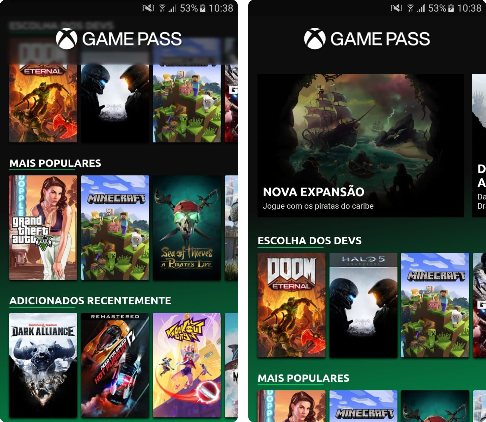
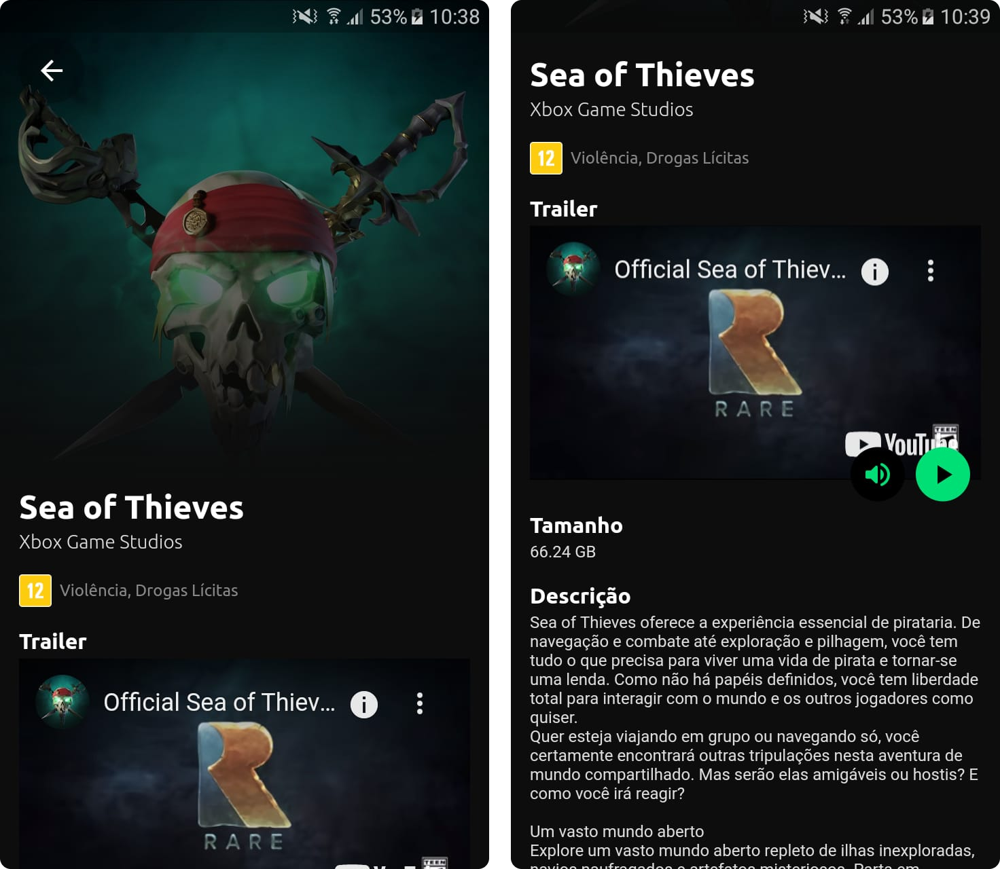

# Xbox Game Pass Mobile App

A mobile app to browse the [Xbox Game Pass](https://www.xbox.com/en-us/xbox-game-pass) games library.

> This app does not have any connection with the Xbox Game Pass official app and was made for educational purposes only. If you want to see the real updated library please download the **official app**.

## :iphone: Demo / Screenshots


### Home



### Game



## :video_game: Usage

This app does not have any built app so far. If you want use the app you have to clone this repository locally and run the app yourself. For this, see the [Installation Topic](#construction_worker-installation).

## :page_facing_up: About the Project

### Available Languages

The application supports only the  Brazilian Portuguese language so far.

The support for the English language isn't planned.

### Motivation

This app was made to improve my flutter skills, besides the fact the official app was quite slow and with an annoying UI/UX.

### Architecture

This app was built using the principles of [SOLID](https://en.wikipedia.org/wiki/SOLID) and [DDD](https://en.wikipedia.org/wiki/Domain-driven_design).

For more details see the file [ARCHITECTURE.md](ARCHITECTURE.md)

### License

This project is licensed under the [MIT License](LICENSE)

## :test_tube: Technologies


### Flutter

Flutter is an open-source UI software development kit created by Google. It is used to develop cross-platform applications for Android, iOS, Linux, Mac, Windows, and the web from a single codebase. (Wikipedia)

Website: https://flutter.dev/

### Dart

Dart is a programming language designed for client development, such as for the web and mobile apps. It is developed by Google and can also be used to build server and desktop applications. (Wikipedia)

Website: https://dart.dev/

### Dependencies

#### http

A composable, Future-based library for making HTTP requests. (Official repository)

Github: https://github.com/dart-lang/http

#### youtube_player_flutter

Flutter plugin for playing or streaming YouTube videos inline using the official iFrame Player API. (Official repository)

Github: https://github.com/sarbagyastha/youtube_player_flutter

#### flutter_native_splash

Flutter plugin that generates native code to customize Flutter's default white native splash screen with background color and splash image. Supports dark mode, full screen, and more. (Official repository)

Github: https://github.com/jonbhanson/flutter_native_splash

> This dependency is not included in the `pubspec.yaml` file because of conflicts with the `flutter_launcher_icons` dependency. If you need to re-generate the splash screen, install this dependency again, generate the splash screen, then uninstall it.

#### flutter_launcher_icons

Flutter plugin that simplifies the task of updating your Flutter app's launcher icon. (Official repository)

Github: https://github.com/fluttercommunity/flutter_launcher_icons

> This dependency is not included in the `pubspec.yaml` file because of conflicts with the `flutter_native_splash` dependency. If you need to re-generate the launcher icon, install this dependency again, generate the launcher icon, then uninstall it.

## :construction_worker: Installation

### Tools

You go need these tools to install this repository on your local machine:

- Git -> https://git-scm.com/downloads
- Flutter & Dart -> https://flutter.dev/docs/get-started/install

After you install all these tools up head, you can proceed to the next topic.

### Running Locally

#### Cloning the Repository:

First of all, clone the repository by running the following command:

```bash
git clone https://github.com/cauaspinheiro/gamepass_mobile
```

After this, go to the project's folder by running the following command:

```bash
cd gamepass_mobile
```

#### Installing the project's dependencies

You can install the project's dependencies by running the following command inside the project's folder:

```bash
flutter pub get
```

---

**That's it!** Now you can run the project on your local machine.

For this, see the ["Run the app" topic](https://flutter.dev/docs/get-started/test-drive?tab=terminal) on Flutter's official documentation.

## :link: Useful Links

- The REST API that this application uses: https://github.com/cauaspinheiro/gamepass-api
